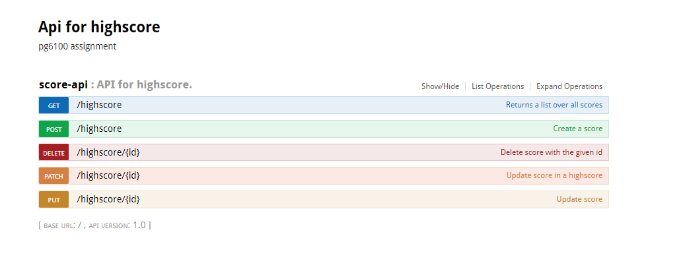

# Highscore-service #

 ### <i>Description</i> ###
 
 The highscore microservice is made to keep track of all the best scores from the quiz.

 ### <i> RESTful </i> ###
 
 The api is made with level 2 standards of RESTful api. It follows rules for the URL and HTTP verbs. My url is /highscore and not /highscores because it will always be one list over the best scores,
 not multiple. It still could probably make more sense to have it as /highscores according to REST standards, but I just left it at /highscore
  

 ### <i> Swagger </i> ###
  I have implemented Swagger and you can view it in the following url
   
  <i> /highscore/swagger-ui.html </i>

  

 ### <i>Clarifications about the endpoints</i> ###
 

    I have implemented all five http verbs required in the ScoreApi class.  
    <code> GET /highscore </code>  
    The GET method returns all scores and sorts them with the highest score on top using the sortedByDescending function.  
    <code> POST /highscore </code>  
    The POST method creates a new score and adds it to the database, and the method returns the id of the created score with a 201 response  
    <code> DELETE /highscore/{id} </code>  
    The DELETE method takes in a id of the score it wants to delete and then removes it from the database with a 204 response 
    <code> PUT /highscore/{id} </code>  
    The PUT method find a score it wants to replace and puts a new resource over it and returns 204 
    <code> PATCH /highscore/{id} </code>  
    The PATCH method gets in a score it wants to change with an id, and then it swaps that value for the new one. Returns 204  
 

 ### <i>Tests</i> ###
 #### Rest Assured ####
 I have made RestAssured tests for all of my endpoints.  
 My GET test was kinda tricky so I used an assertEquals to the expected output.  
 It is not the best way to do it, but it works.  

 #### TestBase ####
 I have two methods in the ScoreTestBase class which makes testing easier.  
 Both methods are a post and they return either a dto or the id to the created score.