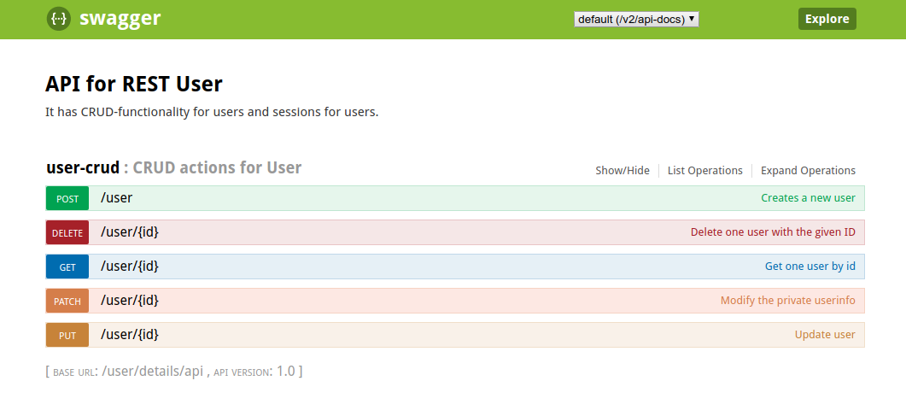

# User

### <i>Description</i> ###

This handles user-details associated with users.  
It has a user-entity and a rest-controller.

### <i>How to run</i> ###

To run tests and build .jar-file from sources:  
<code>$ mvn clean install </code>

 
To run the service with docker:  
<code>$ docker-compose up --build </code> 
(requires to build all other sources and run this command from root-folder)

 
URL: `/user/details/api/ <your-request> `

### <i> RESTful </i> ###

The user-service is created with REST lvl. 2 in mind.
It uses HTTP-verbs like GET, POST, PUT, PATCH and DELETE and specifies the resource in the URL. 
The Id of the resource is specified the resource id in the url after the resource.

### <i> Security </i> ###

One important concept with the security in this module is that users cant see or change other users information.
Therefore should check username in cookie with username from the ID in the URL. 

There is also some form of validation of the URL.

Wanted security is enabled for RestAssured-tests [here](src/test/kotlin/no/group3/SpringQuiz/user/api/WebSecurityConfigLocal.kt), but disabled in running service. 
The reason is that we get 403(forbidden) on almost all requests and couldnt get it to work with other services. 
Therefore i had to open up security for e2e-tests to pass. It works, 
but not as intended and i would never accept this solution if it wasnt that i ran out of time trying to figure it out.

 ### <i>Tests</i> ###
 ##### rest assured #####
 

 
 Security is enabled for RestAssured-tests and runs with in-memory authentication. 
 This is the [security](src/test/kotlin/no/group3/SpringQuiz/user/api/WebSecurityConfigLocal.kt) i would like to use on the service, but couldnt get to work.
 
 The tests are separated into: model- and api- tests.
 
 The api-tests uses an abstract [class](src/test/kotlin/no/group3/SpringQuiz/user/api/UserTestBase.kt) with configurations for the tests.
 
 

 
  ##### e2e ##### 

The end-to-end test is called testUser and is located in the [SpringQuizIT](../e2e/src/test/kotlin/no.group3.SpringQuiz.e2e/SpringQuizIt) class.

This test creates a valid cookie in redis,
 creates a user in the DB and patches the user.
The body is formatted as pure json
 

### API

Endpoints are documented with swagger on: 
/user/details/api/swagger-ui.html

The API also incorparates actuator for checking the status of the running service.

The endpoints are structured as:  
`/user` 
`/user/{id}` 

### Documentation

I use Swagger and jacoco. 
Jacoco is generated in "test"-phase when running maven.  
Swagger is reachable when system is running with docker-compose.  
The url is: `<your-server>/user/details/api/swagger-ui.html`

